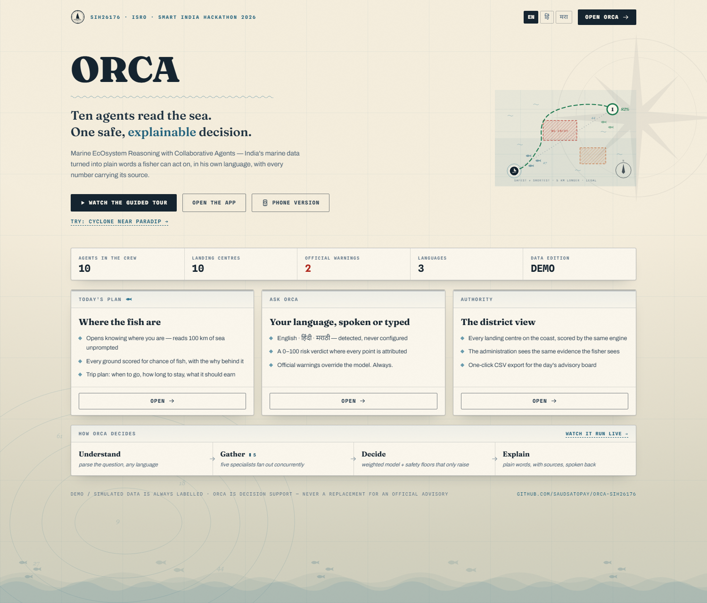
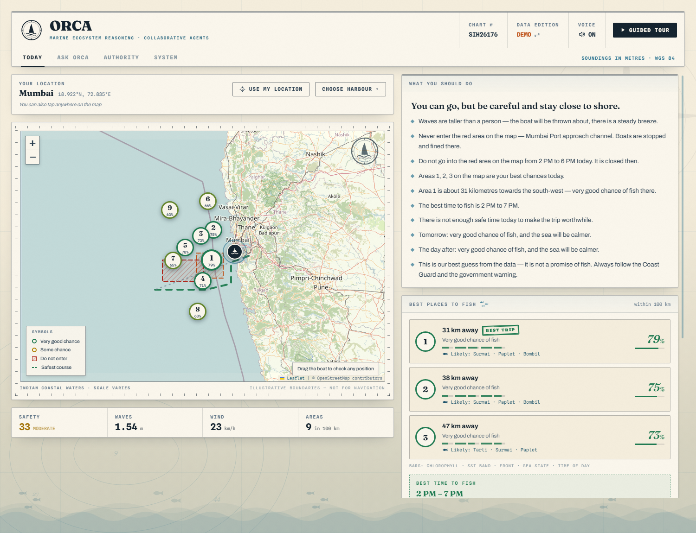
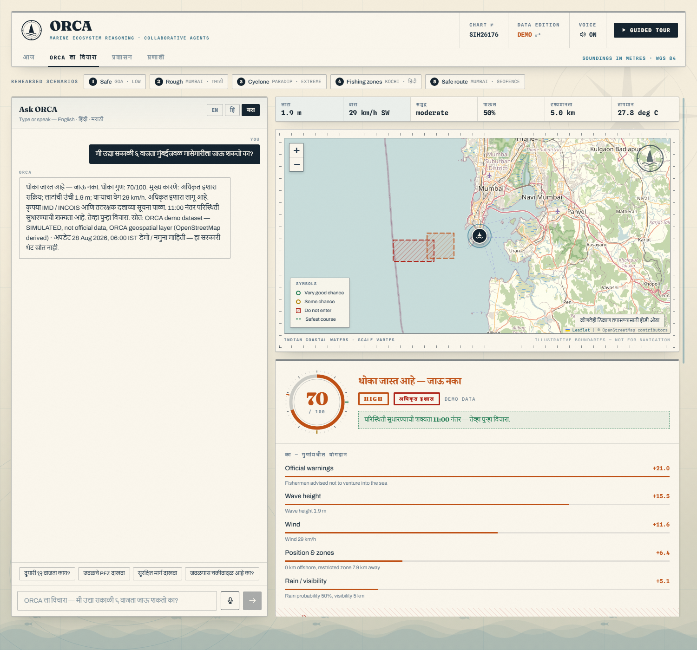
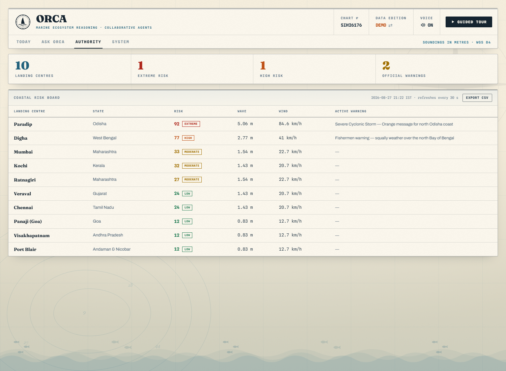
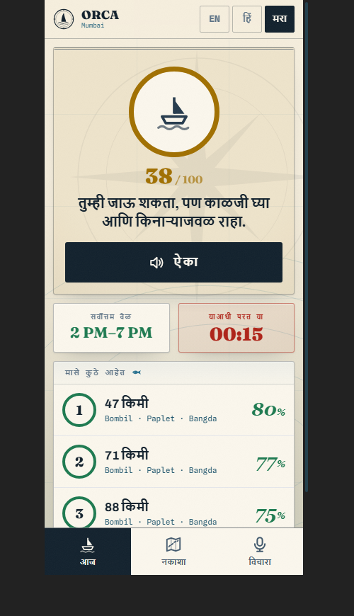
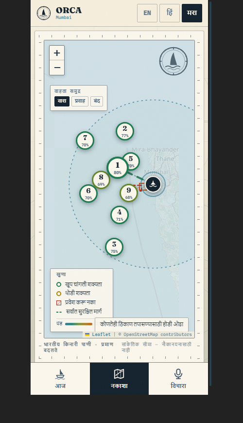
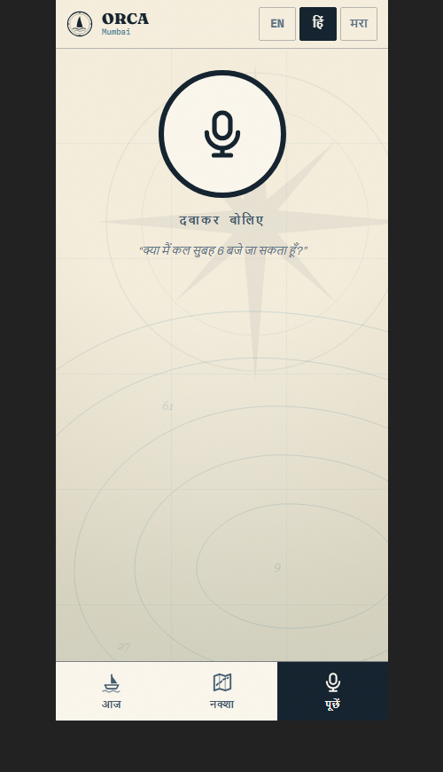
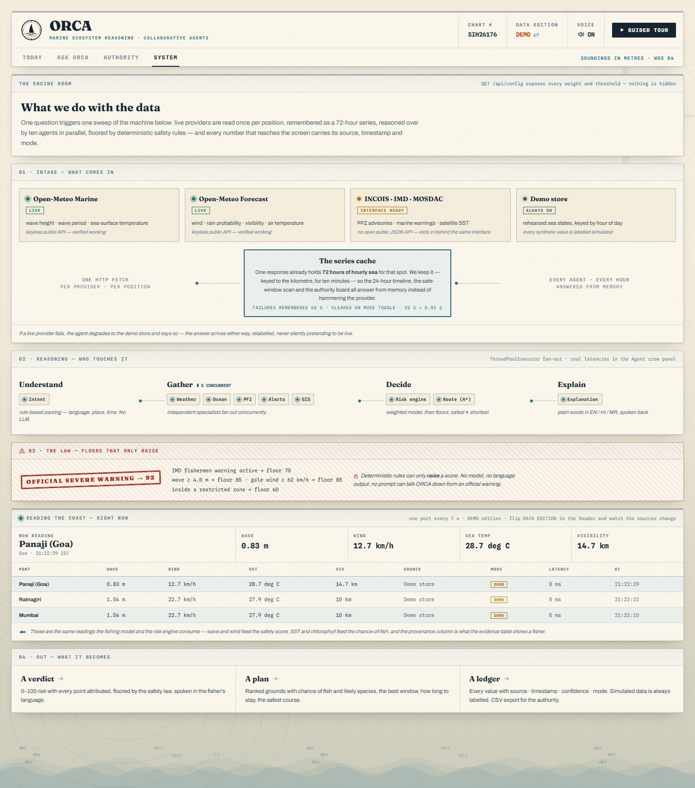
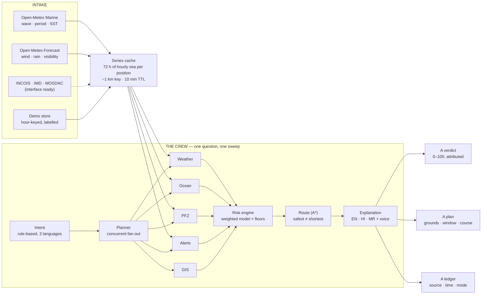

<div align="center">


### Marine EcOsystem Reasoning with Collaborative Agents

**Ten agents read the sea. One safe, explainable decision — in the fisher's own language.**

[](https://sih.gov.in)
[](https://sih.gov.in)
[](#)
[](#the-stack)
[](#the-stack)
[](#the-stack)
[](#live-data--what-we-actually-do-with-it)
[](#quickstart)

*"Can I go fishing tomorrow at 6 AM?" is a life-or-death question on India's coast.*
*ORCA answers it with evidence, in Marathi, Hindi or English — and shows its working.*

</div>

---

<div align="center">

[**Quickstart**](#quickstart) ·
[**What's inside**](#a-tour-of-the-app) ·
[**Architecture**](#architecture) ·
[**Live data**](#live-data--what-we-actually-do-with-it) ·
[**The models**](#the-fishing-model) ·
[**API**](#api) ·
[**Design**](#the-design-a-living-nautical-chart) ·
[**Roadmap**](#roadmap)

</div>

---

## The one-line pitch

> ORCA is **not a chatbot**. It is a crew of ten cooperating agents that turn India's
> marine data into one safe, explainable decision for a fisher — where the fish are,
> whether it is safe to go, when to leave, how long to stay, and which course avoids
> the areas that get boats fined or worse. Every number carries its **source,
> timestamp and confidence**. Official warnings **override everything**.

ORCA is decision support. It never replaces official IMD / INCOIS advisories or
Coast Guard instructions — and it says so, on every screen.

---

## Screenshots

| The front door | Today — the fisher's plan |
|:---:|:---:|
|  |  |
| *Live coastline stats, the plotted-course hero, three ways in* | *Ranked grounds with chance-of-fish, likely species, factor analytics, trip plan* |

| Ask ORCA — Marathi in, Marathi out | Authority — the district view |
|:---:|:---:|
|  |  |
| *70/100 HIGH with every point attributed, stamped verdicts, safety overrides* | *Every landing centre scored by the same engine, CSV export* |

**The phone app — for the fisher himself** (`/?m=1`, or just open it on a phone)

| Today — one tap to hear the plan | The living chart | Ask by voice |
|:---:|:---:|:---:|
|  |  |  |

*Colour-coded verdict, a giant LISTEN button that speaks the whole plan in the
fisher's language, tap-to-hear area cards, and a microphone as the interface —
designed for users who may read little. Installs to the home screen as a PWA.*

**The engine room — architecture, live** (`/?tab=system`)



*Providers with pulsing status → the 72-hour series cache → the concurrent agent crew →
the safety law → a live feed reading the coast port by port, with provenance on every value.*

---

## Quickstart

**One double-click:** `RUN-ORCA.bat` — starts the backend and opens the app.

Or from a terminal:

```powershell
.\start-orca.ps1
```

Then open <http://127.0.0.1:8000>. That is the whole demo — **one process, one
port, no database, no API key, no internet required.** (The map's street tiles
and live weather want a connection; everything else, fonts included, is served
locally and the app degrades gracefully without it.)

| Command | What it does |
|---|---|
| `RUN-ORCA.bat` / `.\start-orca.ps1` | Demo mode (cached, rehearsed data). **Use this on stage.** |
| `.\start-orca.ps1 -Live` | Live public providers, auto-falls back to cache per reading |
| `.\dev.ps1` | Hot-reload backend + Vite HMR frontend |
| `cd backend; python smoke_test.py` | All five demo scenarios, headless, with pass/fail |

### Deep links

| Link | What it opens |
|---|---|
| `/` | The landing page |
| `/?tour=1` | The 17-step self-narrating guided tour |
| `/?tab=home\|ask\|authority\|system` | A specific view, skipping the landing |
| `/?at=21.675,72.18` | Today view pinned to a position (skips GPS) |
| `/?demo=safe` | Goa — calm seas, **LOW 9/100** |
| `/?demo=danger` | Mumbai — asked in Marathi, **HIGH 70/100**, IMD warning, clears after 11:00 |
| `/?demo=cyclone` | Paradip — **EXTREME 92/100**, official warning overrides the model |
| `/?demo=pfz` | Kochi — asked in Hindi, ranked fishing zones |
| `/?demo=route` | Mumbai — safest route detours the naval area, live geofence |

---

## A tour of the app

### The phone app — for the fisher himself
Open ORCA on a phone (or add `?m=1`) and it becomes a different product,
designed for users who may read little: **zero taps** to a big colour-coded
verdict circle, **one tap** on a giant LISTEN button to hear the whole plan
spoken in your language, area cards that speak themselves, a full-screen
living chart, and a **giant microphone** to ask by voice. Three bottom tabs —
Today · Map · Ask — never anything deeper. It ships with a PWA manifest, so
*Add to Home Screen* installs it like an app — the path to Android.

### The landing page
A chart-styled front door: live coastline stats (centres monitored, official
warnings — pulled from the running engine), the plotted-course hero, three doors
in, and the four-phase decision pipeline. Every deep link skips it.

### Today — what a fisher sees the moment the app opens
- **Finds you automatically** (GPS), or pick a harbour, or tap anywhere on the map
- **Fishing chances within 100 km** — every ground scored 0–100 for the likelihood
  of fish, numbered so *area 1 always means best chance*
- **Likely species per ground** — bangda, tarli, surmai… from documented
  SST/chlorophyll bands. Indicative, never a promise, and labelled so
- **The five model factors drawn on every ground** — chlorophyll, SST band,
  thermal front, sea state, time of day — nothing is a black box
- **Plain language, no jargon** — *"Do not go into the red area from 2 PM to 6 PM
  today"*, *"waves are about knee to waist high"*
- **Best time to fish** and **how long to stay** — hours on the ground, travel each
  way, whole-trip length, shortened automatically when the weather closes in
- **Three-day outlook** — each day scored at its own best hour
- **Areas to stay out of**, with the hours they are closed

### Ask ORCA — the conversational view
- Ask in **English, Hindi or Marathi**, typing or speaking (browser Web Speech API — no key)
- Language is **auto-detected**; spoken answers come back in the same language
- **Risk verdict as a stamped document** — 0–100 instrument dial, ranked factor
  contributions, deterministic overrides shown as the trust moment they are
- **"When is it safe to go?"** — 24-hour risk curve with the best window boxed
- **Conditions instrument bank** — wave, wind, sea state, rain, visibility, SST
- **Context is kept** — *"what about 12 PM?"* re-checks only what changed
- **Agent crew panel** — the real execution trace, grouped by phase, with measured
  latencies and the parallel fan-out made visible

### The chart (both views)
A drafted nautical chart, alive: tick-marked neatline, compass rose, **hatched
danger areas**, numbered **buoy markers that ride the swell**, the recommended
course's dashes running, a **draggable vessel** that geofences any position live —
drop it in a restricted area and ORCA objects immediately; drop it on land and
ORCA tells you that too. And the **sea itself moves**: an
earth.nullschool-style particle field animates the **wind or surface current**
over the water (switchable, colour-coded by speed) above a **sea-temperature
shade** — fed in LIVE mode by real Open-Meteo grids fetched in a single
multi-point call, and in DEMO mode by a labelled synthetic field. Cyclone
warnings are drawn too: hatched warning area, forecast track, a spinning storm
symbol.

### Authority — the district view
Every monitored landing centre ranked by the same engine, auto-refreshing every
30 s, with active warnings inline and **one-click CSV export** of the day's board.

### System — the engine room (`/?tab=system`)
The whole machine on one sheet, running: provider cards with pulsing live status,
the series cache explained, signals travelling the agent pipeline, the safety
floors stamped in red — and a **live feed that reads the coast port by port**,
showing the exact readings, sources, modes and latencies the agents consume.

---

## Architecture



Ten agents: `intent · planner · weather · ocean · pfz · cyclone · gis · risk · route · explanation` —
independent specialists run concurrently via a `ThreadPoolExecutor` fan-out in
`agents/planner.py`. The risk engine waits for all of them; no agent's opinion can skip it.

<details>
<summary><b>The same picture in ASCII, for terminals</b></summary>

```
                     ┌──────────────┐
   user (text/voice) │ Intent agent │  language · place · time · activity
        │            └──────┬───────┘
        ▼                   ▼
   ┌─────────────────────────────────────┐
   │  Planner / Orchestrator             │  decides who runs, runs them in parallel
   └──┬────────┬────────┬────────┬───────┘
      ▼        ▼        ▼        ▼        ▼
   Weather   Ocean    PFZ     Alerts    GIS          ← run concurrently
      │        │        │        │        │
      └────────┴────────┴────────┴────────┘
                        ▼
                  ┌───────────┐
                  │Risk engine│  rules + weighted model + deterministic floors
                  └─────┬─────┘
                        ▼
                  Route optimiser (A*)
                        ▼
                 Explanation agent  → answer + evidence, in the user's language
```

</details>

### Why this is not a chatbot

1. **The LLM never decides safety.** Intent parsing is deterministic and
   rule-based; the risk score comes from a documented weighted model; and
   **deterministic safety floors can only raise a score, never lower it**. An
   active IMD severe warning forces EXTREME regardless of what any model says.
2. **Every number is traceable.** Each value carries `source · timestamp ·
   confidence · mode`, surfaced in the UI's evidence table.
3. **Synthetic data is always labelled.** Demo values are stamped
   *"Demo / simulated data — not a live government feed"*. Nothing synthetic is
   ever presented as an official feed.
4. **It refuses to send you somewhere illegal — or somewhere dry.** Candidate
   fishing grounds inside a marine protected area, defence zone or port limit are
   filtered before ranking, and a pure-Python landmass layer keeps every
   generated ground at sea, whatever point on the coast you tap.

---

## Live data — what we actually do with it

The part everyone asks about, in order:

**1 · Pull.** In LIVE mode, two keyless public providers are read **once per
position**: Open-Meteo **Marine** (wave height, wave period, sea-surface
temperature) and Open-Meteo **Forecast** (wind, rain probability, visibility, air
temperature). One response already contains **72 hours of hourly data** for that
point.

**2 · Remember.** That full hourly series goes into an in-process cache keyed to
the kilometre (`data/live_client.py`) — 10-minute TTL, failures remembered for
60 s so a dead network degrades in seconds, cleared on every mode toggle. This is
why the 24-hour risk timeline costs **0.02 s instead of 32 s**: the timeline, the
safe-window scan, the trip planner and the authority board all answer from the
same remembered series instead of hammering the provider per hour.

**3 · Reason.** Each specialist derives its view from the same series — the ocean
agent reads wave/SST, the weather agent wind/rain/visibility, the fishing model
turns SST + chlorophyll into chance-of-fish and likely species, the risk engine
fuses all of it and then applies the floors.

**4 · Prove.** Every derived number is written to the evidence ledger with
`source · timestamp · confidence · mode` — the same rows the fisher sees under
"Evidence", the authority exports as CSV, and the System page streams live.

**5 · Degrade honestly.** If a provider call fails, that agent falls back to the
demo store **and says so** — relabelled, never silently pretending to be live.
(In LIVE mode the ocean agent always shows amber: Open-Meteo has no surface-current
field, so that one value comes from the demo store, and the agent admits it.)

| Source | Provides | Status |
|---|---|---|
| Open-Meteo Marine | wave height/period, SST | **verified live**, keyless |
| Open-Meteo Forecast | wind, rain probability, visibility | **verified live**, keyless |
| INCOIS | PFZ advisories, ocean state | no open public JSON API — provider interface ready |
| IMD | marine warnings, cyclone bulletins | no open public JSON API — provider interface ready |
| ISRO MOSDAC | satellite SST / ocean colour | registration-gated — interface ready |
| OBIS · Map of Life | species occurrence records, Indian coastal waters | open data, **bundled as a dated snapshot** so the demo runs offline |
| OpenStreetMap | basemap, coastline reasoning | keyless standard tiles |

> **The honest position** (we say this out loud, including to judges): INCOIS,
> IMD and MOSDAC publish through portals and bulletins, not a documented open
> JSON API a student team can key into. ORCA is built behind a **provider
> interface** — Open-Meteo is the live provider today; the agencies slot in via a
> data-sharing arrangement or bulletin parser **without touching agent code**. We
> never label Open-Meteo output as INCOIS or IMD data.

---

## The fishing model

Answers *where am I likely to catch something, when, and for how long* — the
question a fisher actually asks. Five documented factors:

| Factor | Weight | Why |
|---|---|---|
| Chlorophyll | 34% | plankton → forage fish → catch; the core INCOIS PFZ signal |
| Sea-surface temperature | 20% | target species concentrate in a temperature band |
| Thermal front strength | 16% | a sharp SST change marks where bait accumulates |
| Sea state | 18% | rough water scatters shoals and stops gear being worked |
| Time of day | 12% | dawn and dusk feeding peaks |

Two numbers come out of it, and they are deliberately different:

- **Chance of fish** — a statement about the water. Grounds are numbered by this,
  so "area 1" always means "best chance".
- **Trip value** — the same odds discounted by how far you have to steam. This
  picks the ground we actually route to and badge *Best trip*, because a slightly
  better ground twice as far away is usually the wrong advice.

On top of that, an **indicative species mix** (bangda/mackerel, tarli/sardine,
paplet/pomfret, surmai/seer, bombil/Bombay duck, hilsa/ilish) is derived from
documented SST/chlorophyll bands per ground, **weighted by real regional
occurrence records** (an OBIS / Map of Life snapshot of Indian coastal
waters) — so the oil sardine headlines Kerala, Bombay duck headlines Mumbai
and hilsa appears in Bengal, exactly as the records say. Local names first,
because that is what a fisher calls them. Trip length comes from the odds, the distance and the
remaining safe-weather window — and is cut short automatically when the weather
closes in.

## The risk engine

```
score = 100 × Σ weightᵢ × factorᵢ        then deterministic floors are applied
```

| Factor | Weight | Rationale |
|---|---|---|
| Wave height | 25% | dominant capsize driver for small craft |
| Official warnings | 25% | an advisory is evidence, not noise |
| Wind | 20% | |
| Rain / visibility | 10% | |
| Sea state & current | 10% | |
| Position & zones | 10% | distance offshore, restricted-zone proximity |

Bands: **LOW** ≤ 25 · **MODERATE** ≤ 50 · **HIGH** ≤ 79 · **EXTREME** 80+.
EXTREME is reserved for life-threatening conditions or an active severe warning,
so "EXTREME" always means *do not launch, no judgement call*.

Deterministic floors — they can only **raise** the score:

| Trigger | Floor |
|---|---|
| Official **severe** warning (cyclone / tsunami) | 92 |
| IMD fishermen warning active | 70 |
| Wave ≥ 4.0 m | 85 |
| Wind ≥ 62 km/h (gale) | 85 |
| Position inside a restricted zone | 60 |

All of it is live at `GET /api/config` — we show judges that endpoint rather than
claiming the weights are settled science.

---

## API

| Endpoint | Purpose |
|---|---|
| `GET /api/fishing?lat&lon&radius_km&days&lang` | **everything for a position** — safety, grounds + species, timing, trip length, 3-day outlook, plain-language advice |
| `POST /api/chat` | the full agent pipeline for one question |
| `GET /api/forecast?lat&lon&when` | raw weather + ocean readings with provenance (drives the System live feed) |
| `GET /api/risk?lat&lon&when` | risk assessment with inputs |
| `GET /api/risk/timeline?lat&lon&hours` | hour-by-hour risk curve |
| `GET /api/position?lat&lon` | fast geofence + land check (drives the draggable boat) |
| `POST /api/config/mode` | switch LIVE ⇄ DEMO at runtime (clears the series cache) |
| `GET /api/map/zones` \| `/pfz` \| `/ports` | GeoJSON layers |
| `GET /api/alerts?lat&lon` | marine + geofence alerts |
| `POST /api/routes` | safest vs direct route |
| `GET /api/authority/dashboard` | coastal risk board |
| `GET /api/config` | weights, thresholds, overrides |
| `GET /api/scenarios` | the five rehearsed demos |

Interactive docs: <http://127.0.0.1:8000/docs>

---

## The stack

**Backend** — Python 3.10 · FastAPI · pydantic v2 · httpx. **Four dependencies**,
so it installs in seconds on any laptop. Geometry (haversine, ray-casting
point-in-polygon, A*, the landmass layer) is pure Python: no shapely/GEOS install
to fail on stage. PostGIS and XGBoost are the documented production path, not
demo requirements.

**Frontend** — React 18 · TypeScript · Tailwind · Leaflet · Vite. Voice in/out is
the browser's own Web Speech API — no key, no server round-trip.

```
orca/
├─ RUN-ORCA.bat        one-click launch
├─ backend/app/
│  ├─ agents/          intent, planner, weather, ocean, pfz, cyclone, gis,
│  │                   risk, route, explanation
│  ├─ services/        risk_engine, fishing (+species), route_optimizer,
│  │                   plain_language, i18n
│  ├─ data/            geo (pure-python GIS + landmass), demo_store,
│  │                   live_client (series cache)
│  ├─ api/             chat, fishing, forecast, map, alerts, routes
│  └─ config.py        weights, thresholds, overrides, data mode
├─ frontend/src/
│  ├─ components/      Landing, MarineMap, FishingPanel, ChatPanel, RiskCard,
│  │                   RiskDial, RiskTimeline, AgentTrace, AuthorityPanel,
│  │                   SystemPanel, GuidedTour, glyphs
│  └─ App.tsx
└─ docs/               the screenshots above
```

## The design: a living nautical chart

The interface is drawn the way sea charts are drawn — because that is the visual
language this domain already speaks, and because a light sheet projects far
better than a dark dashboard on a hackathon projector.

- **Chart paper & marine ink** — warm paper, hairline rules, graticule, aged
  edges, bathymetric-contour and compass-rose watermarks; the sea itself rises at
  the foot of every page as three drifting swell layers with schools of fish
  crossing upstream.
- **Type with a spine** — Fraunces (display serif) for verdicts, headings and
  buoy numbers; Archivo for body; Spline Sans Mono for instrument readouts; Noto
  Serif Devanagari keeps Hindi and Marathi in the same voice. All self-hosted —
  the identity survives offline.
- **Chart semantics as UI** — restricted areas are *actually hatched*, routes are
  plotted courses whose dashes run, probabilities are set as italic *soundings*,
  verdicts land as rotated **rubber stamps**, the map sits in a tick-marked
  neatline with a compass rose, and every icon is hand-drawn inline SVG (no
  emoji — they vary by OS and can fail on a projector).
- **Motion with a doctrine** — buoys bob out of phase, the hull rolls, waterlines
  crawl, signals travel the pipeline, bars draw themselves in, cards lift, badges
  ripple on hover. Every loop is transform-only, every reveal has a fail-safe end
  state, and `prefers-reduced-motion` is honoured — **safety data can never be
  stranded invisible by an animation that didn't run.**

---

## Known limits (we say these out loud)

- Risk weights are an engineering baseline, not a certified maritime standard.
- PFZ logic reproduces the *reasoning* of INCOIS advisories; it is not the
  official advisory, and a potential zone is never a guarantee of fish.
- The species mix is an indicative SST/chlorophyll-band heuristic, labelled so.
- Demo geofences are illustrative polygons, and the landmass layer is a
  simplified coastline (production: OSM/GSHHG).
- Live mode uses open providers; agency feeds need a data-sharing arrangement.
- The ML layer is a documented weighted model. XGBoost training on historical
  incident data is the next step, not a claim we make today.

## Roadmap

1. **Species-band refinement** with fisheries-department catch statistics
2. **Offline PWA install** + service-worker caching, so the app opens at sea
3. **SMS / IVR fallback** for feature phones — the real last mile
4. **Train the risk model** (XGBoost) on historical incident data
5. **Real INCOIS/IMD ingestion** via bulletin parsing or data-sharing
6. **Tide and moon phase** as fishing-model inputs
7. Public deployment for the national round

---

<div align="center">

**Team Random (U3M71E5U)** · Smart India Hackathon 2026 · Problem Statement **SIH26176 (ISRO)**

*Demo / simulated data is always labelled. ORCA is decision support —*
*it never replaces an official advisory.*

</div>
